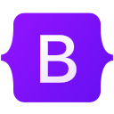
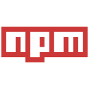
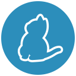

# ¡Hola! Soy Daniel 👋

## Sobre mí

¡Bienvenido/a a mi perfil de GitHub! Soy un desarrollador web especializado en la pila MERN, entusiasta de la tecnología y me apasiona crear aplicaciones web escalables y robustas utilizando las últimas tecnologías.

Soy una persona autodidacta, con muchas ganas de aprender y en constante formación para mejorar mis habilidades como desarrollador. Siempre estoy investigando y aprendiendo nuevas tecnologías para estar al día de las últimas tendencias y mejores prácticas en el desarrollo web.

## Tecnologías

## Habilidades

Habilidades técnicas:
- Desarrollo de aplicaciones utilizando la pila MERN (MongoDB, Express.js, React.js, Node.js)
- Diseño y desarrollo de de API's RESTful utilizando Node.js y Express.js
- Lenguajes de programación: JavaScript (ES6+), TypeScript
- Tecnologías front-end: HTML5, CSS3, React.js, Redux, Redux Toolkit, Bootstrap, Tailwind CSS
- Tecnologías back-end: Node.js, Express.js, MongoDB, Mongoose ODM
- Testing: Jest
- Control de versiones: Git, GitHub
- Herramientas y entorno de desarrollo: Visual Studio Code, npm, Yarn, Postman

Habilidades personales:
- Comunicación efectiva
- Trabajo en equipo
- Resolución de problemas
- Adaptabilidad
- Organización y gestión del tiempo
- Liderazgo
- Empatía
- Orientación al detalle

## Contacto

Si quieres saber más sobre mí o mis proyectos, ¡no dudes en contactarme!

¡Gracias por visitar mi perfil de GitHub! 😊
